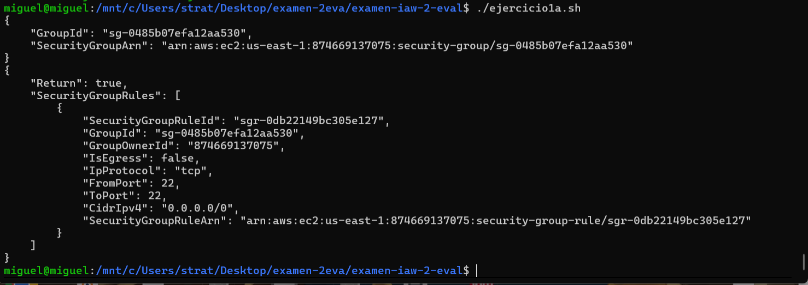
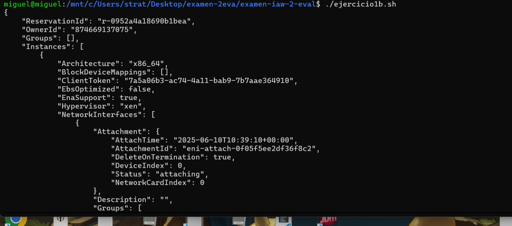

# examen-iaw-2-eval

para la realización del ejercicio 1 hemos hecho lo siguiente:

apartado a.
aws ec2 create-security-group \
    --group-name grupo_seguridad_ejercicio_1 \
    --description "ejercicio1"

aws ec2 authorize-security-group-ingress \
    --group-name grupo_seguridad_ejercicio_1 \
    --protocol tcp \
    --port 22 \
    --cidr 0.0.0.0/0

apartado b .
aws ec2 run-instances \
    --image-id  ami-02457590d33d576c3 \
    --count 1 \
    --instance-type t2.small \
    --key-name vockey \
    --security-groups grupo_seguridad_ejercicio_1\
    --tag-specifications "ResourceType=instance,Tags=[{Key=Name,Value=ejercicio1}]"

